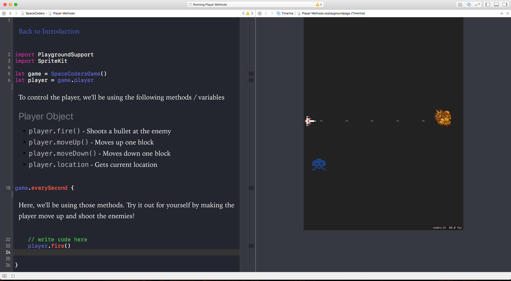

# SpaceCoders


SpaceCoders is an interactive tutorial designed to teach students the basics of AI Game Programming



## Objectives

Space Coders' Objective is to leave students with a basic understanding of how developers create basic AIs

## Goals

- [X] Allow users to play around with the scene by simply typing in code into a function
	-  Implemented through use of variable: ```game.everySecond```	
- [ ] Add more levels and more complicated enemies
- [ ] Improve Art
- [ ] Add more pages to playground to teach the inital basics of programming
- [ ] Export a ```.playgroundbook``` file for the iPad

## Installation

#### To Use

- Simply download a release from the [releases page](https://github.com/ronakdev/SpaceCoders/releases/tag/1.0)

#### For Development

- Due to the finicky nature of Swift Playgrounds, I've wrapped the ```.playground``` file in a bigger folder. Simply fork/clone the repo and open the file in Xcode (Must be Version 8.0 or higher)
